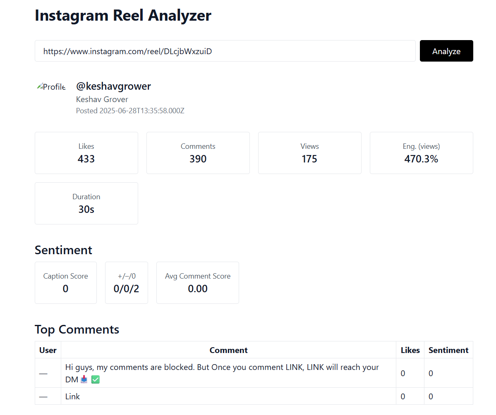

# Instagram Reel Analyzer

A web application to analyze Instagram Reels for performance and sentiment insights using Next.js and Apify.

##  Project Description

Instagram Reel Analyzer enables users to paste any public Instagram Reel URL and get detailed analytics including:

* **User Detection**: Shows the reel owner's username, full name, and profile picture.
* **Performance Metrics**: Displays likes, comments, views, engagement rates (by views & followers), video duration, and time since posted.
* **Sentiment Analysis**: Analyzes caption sentiment and top comments sentiment (positive/negative/neutral) with overall scores.
* **Comment Performance**: Lists top comments by likes, sentiment scores, spam detection, and shows a word cloud of common terms.
* **Hashtag Analysis**: Extracts and displays hashtags used in the caption.
* **Similar Creators**: Recommends similar profiles based on scraping the owner’s recent posts.

Built with **Next.js 14**, **TypeScript**, **Tailwind CSS**, and the **Apify** platform for reliable Instagram scraping.

---

##  Folder Structure

```
reel-analyzer/
├─ app/
│  ├─ api/
│  │  ├─ analyze/
│  │  │  ├─ start/route.ts       # Starts Apify runs for reel & comments
│  │  │  └─ status/route.ts      # Polls runs & aggregates analytics
│  │  └─ similar/route.ts        # Fetches similar creators via Apify
│  ├─ globals.css                # Tailwind base includes
│  ├─ layout.tsx                 # Root layout importing globals
│  └─ page.tsx                   # Main UI: input, polling, display
│
├─ components/
│  ├─ AnalyticsCard.tsx          # Metric cards (likes, views, etc.)
│  ├─ CommentTable.tsx           # Table of top comments
│  ├─ HashtagList.tsx            # Hashtag badges
│  ├─ WordCloud.tsx              # Simple word cloud component
│  └─ SimilarCreators.tsx        # Client component fetching /api/similar
│
├─ lib/
│  ├─ apify.ts                   # Apify client helpers (startActor, getRun, getItems)
│  └─ analytics.ts               # Text and comments sentiment + wordcloud helpers
│
├─ types/                        # TypeScript module shims (react-wordcloud, stopword)
│
├─ styles/
│  └─ globals.css                # Tailwind directives
│
├─ public/
│  └─ avatar.svg                 # Fallback avatar image
│
├─ .env.local                    # APIFY_TOKEN
├─ next.config.js                # Next.js config
├─ tailwind.config.js            # Tailwind configuration
├─ tsconfig.json                 # TypeScript config with path aliases
├─ package.json                  # Dependencies & scripts
└─ README.md                     # This documentation
```

---

##  Setup Instructions

1. **Clone the repository**:

   ```bash
   git clone https://github.com/yourusername/reel-analyzer.git
   cd reel-analyzer
   ```

2. **Install dependencies**:

   ```bash
   npm install
   ```

3. **Configure environment**:

   * Create a file named `.env.local` in the project root.
   * Add your Apify API token:

     ```env
     APIFY_TOKEN=YOUR_APIFY_TOKEN_HERE
     ```

4. **Run the development server**:

   ```bash
   npm run dev
   ```

   Open [http://localhost:3000](http://localhost:3000) in your browser.

5. **Build for production**:

   ```bash
   npm run build
   npm run start
   ```

---

## Screenshots



---

##  Tech Decisions & Why

* **Next.js 14 (App Router)**: Server components and API routes keep scraping logic on the server and client UI lean.
* **TypeScript**: Strict types for safer refactors and clear interfaces (e.g., Apify run payloads).
* **Tailwind CSS**: Rapid, utility‑first styling keeps components consistent and responsive.
* **Apify Platform**: Robust, managed Instagram scrapers avoid constant break‑fix cycles vs. custom Puppeteer/Playwright.
* **Fire‑and‑Poll Pattern**: Avoids serverless timeouts by starting scrapes asynchronously and polling status.
* **Modular Components**: `AnalyticsCard`, `CommentTable`, etc., for reusability and clarity.
* **Zero‑dep WordCloud**: Custom simple word cloud avoids peer‑dep and build complexity of D3-based libs.
* **Path Aliases (`@/`)**: Cleaner imports and easier refactoring vs. long relative paths.

---

